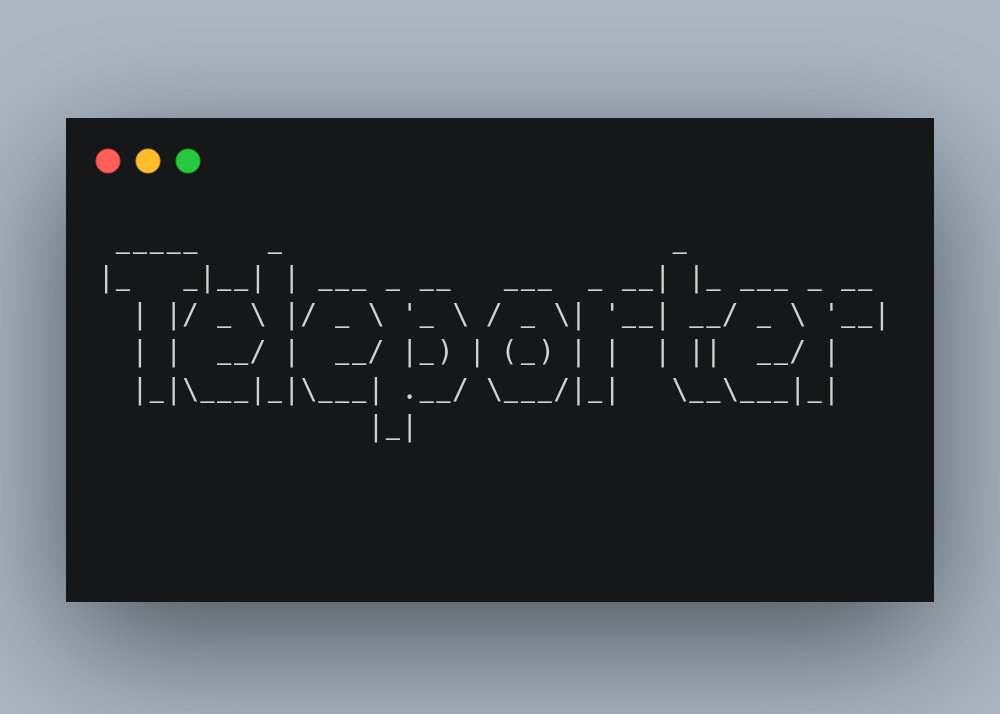

This is terminal tool made completely using python.

As a programmer and a regular Linux user the idea of browsing the web of ddirectories using your terminal used to seem nice at first but now it just gets on my nerves to remember the directory structure to navigate, so much so that I put in 2 days to build this ("I know its too long but, I am a rookie")

And not just through the terminal, its sometime even hard to find the desired folder in the file explorer

There are shell commands like $alias to get by this but I wanted a more daily approach. And this project helped me from changing 

#It got me form this

#To this

*So ya I am Happy*
